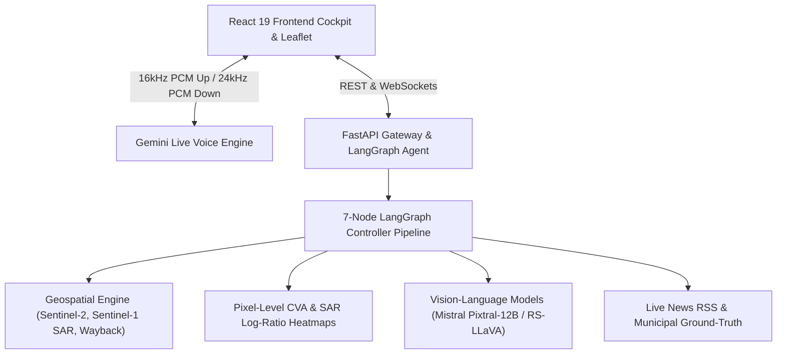

# COSMOCLIP 🛰️

> **Real-Time Multimodal Remote Sensing Conversational AI Assistant & Planetary Intelligence Cockpit**

[](https://reactjs.org/)
[](https://fastapi.tiangolo.com/)
[](https://github.com/langchain-ai/langgraph)
[](https://sentinel.esa.int/web/sentinel/missions/sentinel-2)
[](https://sentinel.esa.int/web/sentinel/missions/sentinel-1)
[](https://ai.google.dev/)
[](https://mistral.ai/)

---

## 🌟 Overview

**COSMOCLIP** is an end-to-end multimodal satellite earth observation cockpit and voice AI system. It enables users to explore any place on Earth using voice or text, perform **bi-temporal change detection** (e.g., comparing historical Wayback imagery with 2026 satellite scenes), inspect **Sentinel-1 C-Band SAR radar telemetry**, generate **deterministic pixel-level Change Vector Analysis (CVA) heatmaps**, and receive spatial evidence contours validated against **real-time municipal news intelligence**.

---

## 🚀 Key Features

- 🛰️ **Multimodal Sensor Switcher**: First-class support for **Optical (Sentinel-2 MSI 10m)**, **SAR (Sentinel-1 C-Band Dual-Pol VV/VH in dB)**, and **Cross-Modal Wavelet/HSV Fusion**.
- ⏱️ **Bi-Temporal Dual-Map Comparison**: Synchronized side-by-side Leaflet maps comparing **Esri Wayback Global Archive (2014–2026)** against current 2026 imagery, with split-slider and difference inspection.
- 🔬 **Deterministic Pixel CVA & SAR Log-Ratio Heatmaps**: Continuous radiometric change vectors mapped to a Turbo colormap with smooth alpha blending and georeferenced to Leaflet `L.imageOverlay`.
- 🎙️ **Full-Duplex Gemini Live Voice Streaming**: 16kHz PCM audio streaming via AudioWorklet with sub-millisecond barge-in interruption, automated tool calling, and Hann-window edge de-clicking filters.
- ⚡ **Real-Time Execution HUD**: Animated 5-phase execution progress bar (`Geocoding` → `Satellite Acquisition` → `Ground Truth News` → `Multimodal AI Reasoning` → `Voice Output`).
- 🌐 **Dynamic Global Geocoding**: Zero hardcoded coordinates; dynamically resolves arbitrary global locations using OSM Nominatim, Photon, and acoustic phonetic search.
- 📰 **Live Ground-Truth Web Intelligence**: Corroborates satellite observations with live Google News RSS headlines and municipal master plan records.
- 📟 **Real-Time Terminal Log Stream**: Live WebSocket event bus (`/api/logs/ws`) with sub-millisecond audit telemetry.

---

## 🏗️ System Architecture

For in-depth architectural design, LangGraph state machine node specifications, geospatial mathematics, and complete API schemas, please refer to:

👉 **[Complete System Architecture Specification](docs/system_architecture.md)**



---

## 📦 Project Structure

```
COSMOCLIP/
├── backend/                  # FastAPI Gateway & LangGraph Agent Controller
│   ├── app/
│   │   ├── agent/            # CosmoClipAgentController, Router, VQA Specialist
│   │   ├── geospatial/       # Sentinel-2, Sentinel-1 SAR, CVA, Wayback, Geocoder
│   │   ├── api/              # REST Endpoints & WebSocket Handlers
│   │   └── schemas/          # Pydantic data transfer models
├── frontend/                 # React 19 + TypeScript + Leaflet Cockpit
│   ├── src/
│   │   ├── components/       # ComparisonStage, ImageStage, ProcessingHUD, Header
│   │   ├── services/         # Voice WebSocket, REST API, Wayback services
│   │   └── App.tsx           # Central state router and cockpit
├── voice_speech/             # Gemini Live Bidirectional Voice Streaming Engine
│   └── engine/               # Audio streaming, tool registry, session manager
├── docs/                     # Detailed architectural specifications
│   └── system_architecture.md
├── run_demo.sh               # Single-command launch script
└── README.md
```

---

## 🛠️ Quick Start

### 1. Prerequisites
- **Python 3.10+**
- **Node.js 18+** & `npm`
- API Keys:
  - `GEMINI_API_KEY` (for Gemini Live voice bridge)
  - `MISTRAL_API_KEY` (for Pixtral-12B Vision-Language reasoning)

### 2. Environment Setup

Create a `.env` file in the project root:

```bash
cp .env.example .env
```

Add your API keys:
```env
GEMINI_API_KEY="your-google-gemini-api-key"
MISTRAL_API_KEY="your-mistral-api-key"
```

### 3. Launch Application

Run the automated launch script:

```bash
./run_demo.sh
```

- **Frontend Cockpit**: `http://localhost:3000`
- **Backend API & Swagger Docs**: `http://localhost:8000/docs`
- **Health Endpoint**: `http://localhost:8000/api/health`

---

## 📜 License

This project is licensed under the MIT License.
