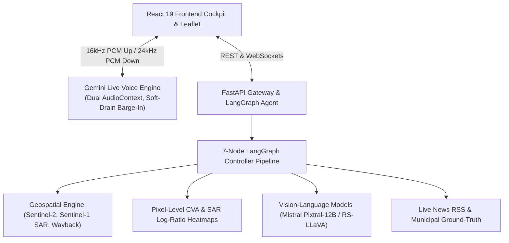

# COSMOCLIP 🛰️

> **Real-Time Multimodal Remote Sensing Conversational AI Assistant & Planetary Intelligence Cockpit**

[](https://reactjs.org/)
[](https://fastapi.tiangolo.com/)
[](https://github.com/langchain-ai/langgraph)
[](https://sentinel.esa.int/web/sentinel/missions/sentinel-2)
[](https://sentinel.esa.int/web/sentinel/missions/sentinel-1)
[](https://ai.google.dev/)
[](https://mistral.ai/)

---

## 🌟 Overview

**COSMOCLIP** is an end-to-end multimodal satellite earth observation cockpit and voice AI system. It enables users to explore any place on Earth using voice or text, perform **bi-temporal change detection** (comparing historical Wayback imagery with current satellite scenes), inspect **Sentinel-1 C-Band SAR radar telemetry**, generate **deterministic pixel-level Change Vector Analysis (CVA) heatmaps**, and receive spatial evidence corroborated against **real-time municipal news intelligence**.

The system features a production-quality **Gemini Live** real-time voice pipeline with zero-click interruption, seamless session resumption, and a completely artifact-free audio playback engine built on dual-context Web Audio API scheduling.

---

## 🚀 Key Features

- 🛰️ **Multimodal Sensor Switcher** — First-class support for **Optical (Sentinel-2 MSI 10m GSD)**, **SAR (Sentinel-1 C-Band Dual-Pol VV/VH in dB)**, and **Cross-Modal Wavelet/HSV Fusion** imagery.
- ⏱️ **Bi-Temporal Dual-Map Comparison** — Synchronized Leaflet maps comparing **Esri Wayback Global Archive (2014–2026)** against current imagery with split-slider and CVA difference heatmap.
- 🔬 **Deterministic Pixel CVA & SAR Log-Ratio Heatmaps** — Continuous radiometric change vectors mapped to a Turbo colormap, georeferenced to Leaflet `L.imageOverlay`.
- 🎙️ **Full-Duplex Gemini Live Voice Engine** — Zero-artifact dual-context Web Audio (mic at native rate, output locked to 24 kHz), server-side VAD barge-in with epoch-tracked soft-drain interruption, and exponential-backoff session resumption.
- 🧭 **Smart Screen Analysis** — Only captures and sends the map canvas screenshot when the query actually requires it (visual analysis), not on navigation or zoom commands.
- ⚡ **Real-Time Execution HUD** — Animated 5-phase progress bar (`Geocoding → Satellite Acquisition → Ground Truth News → Multimodal AI Reasoning → Voice Output`).
- 🌐 **Dynamic Global Geocoding** — Zero hardcoded coordinates; resolves arbitrary global locations via OSM Nominatim, Photon, and AI-assisted phonetic fallback with sanity-guarded null-island rejection.
- 📰 **Live Ground-Truth Web Intelligence** — Corroborates satellite observations with live Google News RSS headlines and municipal records.
- 📟 **Real-Time Terminal Log Stream** — Live WebSocket event bus (`/api/logs/ws`) with sub-millisecond audit telemetry.

---

## 🏗️ System Architecture

For the complete architectural specification, LangGraph node descriptions, geospatial mathematics, and API schemas see:

👉 **[Complete System Architecture Specification](docs/system_architecture.md)**



---

## 📦 Project Structure

```
COSMOCLIP/
├── backend/                    # FastAPI Gateway & LangGraph Agent Controller
│   ├── app/
│   │   ├── agent/              # CosmoClipAgentController, QueryInterpreter, VQA Specialist
│   │   ├── geospatial/         # Sentinel-2, Sentinel-1 SAR, CVA, Wayback, Geocoder
│   │   ├── api/                # REST Endpoints & WebSocket Handlers
│   │   └── schemas/            # Pydantic data transfer models
│   └── tests/                  # Router fallback, current-view, controller tests
├── frontend/                   # React 19 + TypeScript + Leaflet Cockpit
│   ├── src/
│   │   ├── components/         # ComparisonStage, ImageStage, ProcessingHUD, Header
│   │   ├── services/           # VoiceWebSocketClient, REST API, Wayback services
│   │   ├── utils/              # captureView (gated screen capture)
│   │   └── App.tsx             # Central state router and cockpit
├── voice_speech/               # Gemini Live Bidirectional Voice Streaming Engine
│   ├── engine/
│   │   ├── gemini/             # streaming.py (reconnect), session.py, tools.py
│   │   ├── config/             # prompts.py (system instruction), settings.py
│   │   └── conversation/       # ConversationState, SessionManager, epoch tracking
│   └── web/                    # Standalone voice-only web UI (app.js)
├── docs/                       # Detailed architectural specifications
│   └── system_architecture.md
├── run_demo.sh                 # Single-command launch script
└── README.md
```

---

## 🛠️ Quick Start

### 1. Prerequisites

- **Python 3.10+**
- **Node.js 18+** & `npm`
- API Keys:
  - `GEMINI_API_KEY` — for Gemini Live voice bridge
  - `MISTRAL_API_KEY` — for Pixtral-12B Vision-Language reasoning

### 2. Environment Setup

```bash
cp .env.example .env
```

Edit `.env` and add your keys:

```env
GEMINI_API_KEY="your-google-gemini-api-key"
MISTRAL_API_KEY="your-mistral-api-key"
```

### 3. Launch Application

```bash
./run_demo.sh
```

| Service | URL |
|---|---|
| Frontend Cockpit | `http://localhost:3000` |
| Backend API & Swagger | `http://localhost:8000/docs` |
| Health Endpoint | `http://localhost:8000/api/health` |
| Voice Gateway (WebSocket) | `ws://localhost:8000/api/voice/ws` |

---

## 🔧 Recent Improvements (v1.13)

### Audio Engine — Zero-Artifact Playback
- **Dual AudioContext architecture**: separate input context (native rate for mic worklet) and output context (locked to 24 kHz to match Gemini PCM exactly — zero browser resampling)
- **masterGainNode.gain frozen at 1.0**: no `setTargetAtTime`, no `cancelScheduledValues`, no `setValueAtTime` restores — the gain node is never touched after initialization
- **Soft-drain on barge-in**: old epoch nodes drain to their natural end instead of `node.stop()` mid-waveform, eliminating the interruption click
- **Hard-stop only on session teardown**: `node.stop()` called only when the AudioContext is about to close (inaudible)

### Voice Session Resilience
- **Exponential backoff reconnect**: 1 s → 2 s → 4 s → 8 s (capped at 10 s), 8 max attempts per failure event
- **Per-cycle attempt counter reset**: `connect_attempts` resets each outer loop so a prior failure never blocks a post-`go_away` resumption
- **Frontend backoff mirrored**: browser WS reconnect also uses exponential backoff with 8 attempts

### Smart Screen Capture Gating
- Screenshots captured only for `analyze_satellite_image` and `compare_satellite_images` tool calls
- Navigation (`show Paris on map`), zoom, and news queries never trigger canvas capture

### AI Tool Routing Fixes
- `zoom_map` tool description explicitly prohibits invocation for analysis questions about buildings/cars/objects
- System prompt `CRITICAL` rule: when user asks about current screen view, call `analyze_satellite_image` directly — never call `zoom_map` first
- Removed `building/car/area` from zoom trigger keywords to prevent false positive tool chaining

### Context Window Compression
- Compression threshold raised from 16k → 32k tokens to prevent Gemini emitting empty model turns
- Empty model turn error (`"model output must contain either output text or tool calls"`) now caught and recovered from without terminating the session

---

## 📜 License

This project is licensed under the MIT License.
