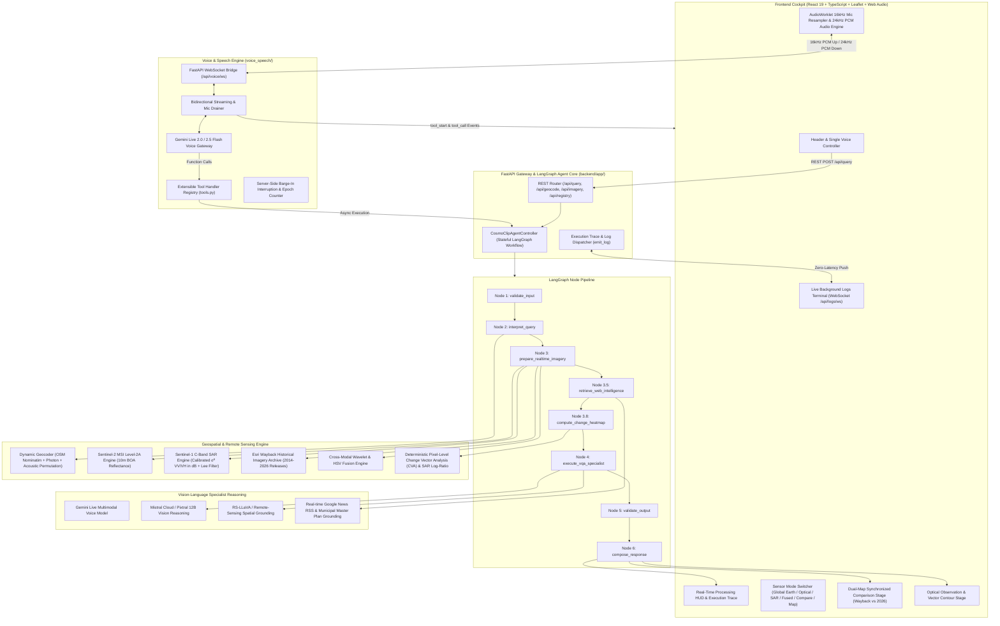

# COSMOCLIP — Complete System Architecture Specification

**COSMOCLIP** is an intelligent, real-time multimodal remote sensing AI cockpit and conversational voice system. It unifies **Sentinel-2 MSI Optical** imagery, **Sentinel-1 C-Band SAR Radar** telemetry, **Esri Wayback Global Imagery Archives (2014–2026)**, **Pixel-Level Change Vector Analysis (CVA)**, **Live Municipal Ground-Truth News Intelligence**, and **State-of-the-Art Vision-Language Models (Gemini Live, Mistral Pixtral-12B, RS-LLaVA)** behind a stateful LangGraph agentic workflow.

---

## 1. High-Level Architecture Diagram

---

## 2. Core System Components

### A. Frontend Layer (`frontend/src/`)
Built with **React 19**, **TypeScript**, **Vite**, **Leaflet**, and **Tailwind CSS**.

| Component | File | Responsibilities |
| :--- | :--- | :--- |
| **`App.tsx`** | `frontend/src/App.tsx` | Central state orchestrator, persistent voice session bridge, dynamic observation tab switching, and query execution. |
| **`ComparisonStage.tsx`** | `frontend/src/components/ComparisonStage.tsx` | Dual-map synchronized Leaflet comparison engine (Historical Wayback vs 2026 Satellite), Split-Slider view, Difference Map, Georeferenced Pixel CVA Heatmap Overlays (`L.imageOverlay`), Turbo colormap scale, and Grounded vector polygons. |
| **`ImageStage.tsx`** | `frontend/src/components/ImageStage.tsx` | Single-sensor high-resolution viewport for Optical S2, SAR S1 GRD, or Fused scenes with grounded contour overlays, hover tooltips, and interactive pan/zoom. |
| **`ProcessingHUD.tsx`** | `frontend/src/components/ProcessingHUD.tsx` | Real-time animated execution HUD showing 5 distinct pipeline phases (`Geocoding` → `Satellite Acquisition` → `Ground Truth News` → `Multimodal AI Reasoning` → `Voice & Spatial Output`) with animated gradient progress bars. |
| **`Header.tsx`** | `frontend/src/components/Header.tsx` | Unified brand navigation (`COSMOCLIP`), single-click microphone voice toggle with pulsing status indicators, global location search bar, and System Registry modal trigger. |
| **`LiveLogsViewer.tsx`** | `frontend/src/components/LiveLogsViewer.tsx` | Sub-millisecond terminal log stream connected via `/api/logs/ws` with category filter pills (`LANGGRAPH`, `GEOCODER`, `SENTINEL-2`, `SAR-RADAR`, `MISTRAL-AI`, `WEB-INTEL`). |
| **`ExecutionTrace.tsx`** | `frontend/src/components/ExecutionTrace.tsx` | Audit timeline of all executed LangGraph nodes with measured latencies in milliseconds. |
| **`voiceWebSocket.ts`** | `frontend/src/services/voiceWebSocket.ts` | Web Audio client managing microphone acquisition, AudioWorklet 16kHz resampling, 24kHz PCM chunk playback with **smooth Hann-window edge de-clicking taper** to prevent DAC offset pops/beeps. |

---

### B. Gemini Live Voice Engine (`voice_speech/`)
Operates as a persistent, low-latency bidirectional voice bridge powered by Google Gemini Live:

1. **Audio Streaming Pipeline (`voice_speech/engine/gemini/streaming.py`)**:
   - Transmits 16kHz raw PCM16 microphone audio from browser client to Gemini Live.
   - Drains 24kHz incoming audio chunks from Gemini Live directly to the browser Web Audio graph.
   - Emits instant `tool_start` notifications to trigger the client progress bar and HUD as soon as Gemini decides to call a tool.
2. **Extensible Tool Calling Registry (`voice_speech/engine/gemini/tools.py`)**:
   - `compare_satellite_images`: Performs bi-temporal change detection between baseline year (e.g. 2016, 2020) and 2026, computes pixel CVA heatmaps, and switches client to **Change Compare**.
   - `analyze_satellite_image`: Analyzes remote-sensing features, land cover, water bodies, and infrastructure.
   - `get_location_coordinates`: Dynamically resolves global places and loads satellite scenes.
   - `zoom_map`: Handles voice-driven map magnification and sector panning.
3. **Session Resumption & Circuit Breakers (`voice_speech/engine/conversation/session_manager.py`)**:
   - Automatically tracks `session_resumption.handle` to reconnect without losing conversational memory.
   - Protects against API rate limits with an automated cooldown circuit breaker.

---

### C. Backend LangGraph Agent Controller (`backend/app/agent/`)
Orchestrated by `CosmoClipAgentController`:

| Node | Purpose | Technical Execution |
| :--- | :--- | :--- |
| **`validate_input`** | Input validation | Verifies query structure, session ID, and bounding box parameters. |
| **`interpret_query`** | Intent & Disambiguation | Uses `QueryInterpreter` to resolve typos, extract target entities, and determine whether a query is single-scene analysis or bi-temporal comparison. |
| **`prepare_realtime_imagery`** | Satellite scene generation | Invokes `ImageryService` to fetch Sentinel-2 Optical RGB, Sentinel-1 SAR Dual-Pol GRD ($\sigma^0$), and Esri Wayback baseline archives. |
| **`retrieve_web_intelligence`** | Real-world grounding | Queries live Google News RSS feeds and municipal master development records for the geocoded location via `WebIntelligenceTool`. |
| **`compute_change_heatmap`** | Radiometric & SAR Difference | Executes pixel-level Change Vector Analysis (CVA) over multi-spectral bands ($\Delta \text{RGB}$, $\Delta \text{NDVI}$, $\Delta \text{NDWI}$) and Sentinel-1 SAR log-ratio to generate georeferenced RGBA overlays. |
| **`execute_vqa_specialist`** | Vision-Language Reasoning | Executes domain vision reasoning (`VLMVqaSpecialist`) with Mistral Pixtral-12B / RS-LLaVA to generate spatial evidence polygons with confidence scores. |
| **`validate_output` & `compose_response`** | Telemetry & Response formatting | Synthesizes spoken text response, formats confidence telemetry, and returns structured `QueryResponse`. |

---

### D. Remote Sensing & Geospatial Subsystem (`backend/app/geospatial/`)

1. **Dynamic Geocoder (`geocoder.py`)**:
   - Zero hardcoding: dynamically queries OpenStreetMap Nominatim, Photon Komoot, and Open-Meteo Elevation API.
   - Applies phonetic and acoustic vowel permutations to prevent speech-recognition misspellings.
2. **Sentinel-2 Multispectral Engine (`sentinel2_service.py`)**:
   - 10-meter Ground Sample Distance (GSD) Level-2A Bottom-Of-Atmosphere (BOA) reflectance scenes.
   - Calculates NDVI (Normalized Difference Vegetation Index) and NDWI (Normalized Difference Water Index).
3. **Sentinel-1 C-Band SAR Radar Engine (`sar_service.py`)**:
   - Dual-Polarization Ground Range Detected (GRD): **VV** (surface roughness / building corner reflectors) and **VH** (volume canopy scattering).
   - Radiometric calibration to backscatter coefficient: $\sigma^0_{\text{dB}} = 10 \cdot \log_{10}(\sigma^0)$.
   - Enhanced Lee speckle suppression filter with $7\times7$ spatial damping window.
4. **Esri Wayback Archive Service (`wayback_service.py`)**:
   - Accesses historical WMTS imagery releases from 2014 to 2026 across 12 distinct curated time periods.
5. **Cross-Modal Optical-SAR Fusion (`fusion_service.py`)**:
   - Wavelet intensity substitution fusing high-frequency SAR textures into cloud-penetrating multispectral color representations.
6. **Change Detection & Heatmap Service (`change_detection_service.py`)**:
   - Optical Change Vector Analysis: $\text{CVA} = \sqrt{(\Delta R)^2 + (\Delta G)^2 + (\Delta B)^2 + 2.5(\Delta \text{NDVI})^2 + 3.0(\Delta \text{NDWI})^2}$.
   - SAR Log-Ratio Change: $R_{\text{SAR}} = \left| \log_{10}\left( \frac{\sigma^0_{t_2} + \epsilon}{\sigma^0_{t_1} + \epsilon} \right) \right|$.
   - Maps magnitude to a Turbo colormap with smooth alpha blending and georeferences coordinates into Leaflet `L.imageOverlay` bounds.

---

## 3. Complete REST & WebSocket API Specification

### REST Endpoints

- **`POST /api/query`**: Submits natural language or image VQA queries; returns structured telemetry, imagery URLs, heatmap overlays, and evidence contours.
- **`GET /api/geocode?q={name}`**: Geocodes place names to bounding boxes and preview tiles.
- **`GET /api/imagery/preview/{image_id}`**: Serves cached satellite rasters and CVA heatmaps.
- **`GET /api/registry/status`**: Health and latency monitoring for all models and data providers.

### WebSocket Endpoints

- **`WS /api/voice/ws?session_id={session_id}`**: Bidirectional full-duplex PCM audio bridge to Gemini Live (16kHz PCM upload / 24kHz PCM playback).
- **`WS /api/logs/ws`**: Zero-latency streaming event bus broadcasting internal engine execution steps (`LANGGRAPH`, `GEOCODER`, `STAC-API`, `SAR-RADAR`, `MISTRAL-AI`, `WEB-INTEL`) to the frontend Live Logs terminal.
