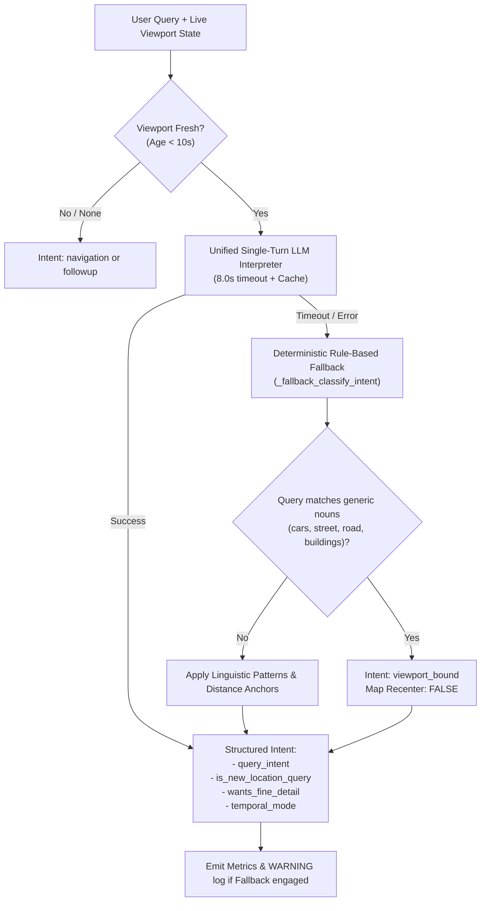
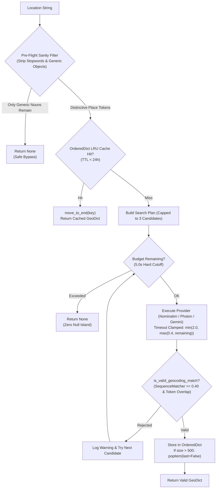

# COSMOCLIP — Complete System Architecture Specification

**COSMOCLIP** is an intelligent, real-time multimodal remote sensing AI cockpit and conversational voice system. It unifies **Sentinel-2 MSI Optical** imagery, **Sentinel-1 C-Band SAR Radar** telemetry, **Esri Wayback Global Imagery Archives (2014–2026)**, **Sub-Meter Native Viewport Tile Stitches (0.3–0.5m GSD)**, **Pixel-Level Change Vector Analysis (CVA)**, **Live Municipal Ground-Truth News Intelligence**, and **State-of-the-Art Vision-Language Models (Gemini Live, Mistral Pixtral-12B, RS-LLaVA)** behind a stateful, fault-tolerant LangGraph agentic workflow.

---

## 1. High-Level Architecture Diagram

### Mermaid Interactive Architecture Flow

```mermaid
graph TD
    subgraph Client ["Frontend Cockpit (React 19 + Leaflet + Web Audio)"]
        UI_Head["Header & Query Bar"]
        UI_HUD["Real-Time Processing HUD"]
        UI_Sensors["Sensor Mode Switcher"]
        UI_Comp["Dual-Map Comparison Stage (Wayback vs 2026)"]
        UI_Opt["Optical Observation Stage (CORS Tile Layers)"]
        UI_Logs["Live Background Logs Terminal (/api/logs/ws)"]
        UI_Audio["AudioWorklet 16kHz Mic & 24kHz PCM Player"]
        UI_Capture["captureCurrentView() (leaflet-image / html2canvas, 1024px JPEG)"]
    end

    subgraph VoiceEngine ["Voice & Speech Subsystem (voice_speech/)"]
        V_WS["FastAPI WebSocket Bridge (/api/voice/ws)"]
        V_Stream["Bidirectional Streaming & Mic Drainer"]
        V_Gemini["Gemini Live 2.0 / 2.5 Flash Voice Gateway"]
        V_State["ConversationState (session_active_entity, active_screenshot_base64)"]
        V_Tools["Extensible Tool Handler Registry (tools.py)"]
        V_Barge["Server-Side Barge-In & Epoch Tracking"]
    end

    subgraph Gateway ["FastAPI Gateway & Agent Controller"]
        API_Router["REST API Router (/api/query, /api/query/current-view, /api/imagery)"]
        LG_Controller["CosmoClipAgentController"]
        CV_Handler["Direct Current-View VLM Pipeline (run_current_view)"]
    end

    subgraph RouterSplit ["Two-Way Query Routing (router.py)"]
        Q_Classify["route_query() / classify(question)"]
        Q_Classify -->|Named Place Present| NavRoute["Query Type: navigation"]
        Q_Classify -->|Everything Else| CVRoute["Query Type: current_view"]
    end

    subgraph NavigationPipeline ["Navigation Pipeline (Unchanged & Hardened)"]
        N_Geo["GeocoderService.geocode() (LRU Cache, Sanity Guard, 5s Budget)"]
        N_Geo -->|Success| N_AOI["Fetch Scene AOI & Prepare Imagery"]
        N_AOI --> N_Recenter["should_recenter_map = True\nis_new_location_query = True\nflyTo([lat, lon], zoom)"]
        N_Geo -->|Failure / Unknown Place| N_Honest["Honest Short-Circuit Response\nshould_recenter_map = False\nMap Remains Untouched"]
    end

    subgraph CurrentViewPipeline ["Current-View Pipeline (Zero Coordinate Reconstruction)"]
        CV_Exec["Specialist VLM (Gemini 2.5 Flash / Mistral Pixtral-12B)"]
        CV_Res["should_recenter_map = False\nis_new_location_query = False\nresolution_badge = 'Analyzing Current Screen View'"]
    end

    %% Client flows
    UI_Head -->|Named Place Navigation Query| API_Router
    UI_Head -->|Current-View Query + Screenshot| UI_Capture
    UI_Capture -->|image_base64 JPEG| API_Router
    UI_Capture -->|screenshot_update| V_WS

    %% Router routing
    API_Router --> Q_Classify
    NavRoute --> N_Geo
    CVRoute --> CV_Handler
    CV_Handler --> CV_Exec --> CV_Res

    %% Voice flow
    UI_Audio -->|16kHz PCM Audio| V_WS
    V_WS -->|24kHz PCM Audio| UI_Audio
    V_WS --- V_Stream
    V_Stream --- V_Gemini
    V_Gemini -->|Function Calls| V_Tools
    V_Tools <--> V_State
    V_Tools -->|image_base64 / Navigation Target| LG_Controller
    V_Stream -->|tool_start & tool_call Events| UI_HUD

    %% Pipeline dependencies & geocoders
    N2 --> GEO_Forward
    VP_Config --> GEO_Reverse
    N3 --> GEO_Opt
    N3 --> GEO_SubMeter
    N3 --> GEO_SAR
    N3 --> GEO_Wayback
    N3 --> GEO_Fusion
    N4 --> M_News
    N5 --> GEO_CVA
    N6 --> M_VLM

    %% Response Delivery & Map Recenter Binary Decision Gate
    N8 --> RecenterGate{"Client Recenter Gate:\nshould_recenter_map == True?"}
    RecenterGate -- True (Navigation Success) --> UI_Move["Leaflet panTo / setView\n(Recenter Map to Destination)"]
    RecenterGate -- False (Viewport Bound / Honest Failure) --> UI_Keep["Leaflet View Anchored\n(Zero Map Movement)"]
    UI_Move --> UI_Comp & UI_Opt
    UI_Keep --> UI_Comp & UI_Opt
    N8 --> UI_HUD

    %% Observability
    LG_Trace -->|Real-Time Logs Push| UI_Logs
```



### Static ASCII System Architecture Diagram

```
+-------------------------------------------------------------------------------------------------------------------------+
|                                        FRONTEND COCKPIT (React 19 + Leaflet + Web Audio)                                |
|  [Header & Voice Toggle]              [Processing HUD]              [Dual-Map Stage]               [Live Terminal Logs] |
|  [AudioWorklet 16kHz Rec]             [24kHz Audio Player]          [Sensor Mode Select]           [Execution Trace]    |
|                                                                                                                         |
|  +-------------------------------------------------------------------------------------------------------------------+  |
|  | VIEWPORT SYNC ARCHITECTURE:                                                                                       |  |
|  | [MapViewer / ComparisonStage] --(debounced 200ms moveend/zoomend)--> [viewportStore (Zustand)]                   |  |
|  | State: { bbox: [W,S,E,N], zoom: int, centerLat/Lng: float, capturedAt: ms_epoch }                                   |  |
|  +-------------------------------------+-------------------------------------------------------+---------------------+  |
+----------------------------------------|-------------------------------------------------------|------------------------+
                                         |                                                       |
               POST /api/query:          |                                                       |  WS /api/voice/ws:
     { question, viewport_bbox,          |                                                       |  { viewport_context: bbox,
       viewport_zoom, captured_at }      |                                                       |    zoom, captured_at }
                                         v                                                       v
+----------------------------------------+-------------------+       +---------------------------+------------------------+
|      FASTAPI GATEWAY & AGENT CONTROLLER (LangGraph)        |       |        VOICE & SPEECH ENGINE (voice_speech/)           |
|  - REST Endpoints (/api/query, /api/geocode, /api/imagery) |       |  - Bidirectional WebSocket Bridge (/api/voice/ws)      |
|  - CosmoClipAgentController Stateful Graph Workflow        |       |  - Gemini Live 2.0 / 2.5 Flash Audio Streaming         |
|  - Execution Trace Dispatcher (Sub-millisecond emit_log)   |       |  - ConversationState (session_active_entity, viewport) |
+----------------------------------------+-------------------+       |  - Tool Handlers (tools.py) with active_viewport_bbox  |
                                         |                           +---------------------------+------------------------+
                                         v                                                       |
+----------------------------------------+-------------------------------------------------------+------------------------+
| LANGGRAPH AGENT EXECUTION PIPELINE (Node 1 -> Node 6):                                                                  |
|                                                                                                                         |
|   [Node 1: validate_input]                                                                                              |
|              │                                                                                                          |
|              ▼                                                                                                          |
|   [Node 2: interpret_query] (Unified Router + Fallback, 10s Viewport Freshness Check)                                   |
|              ├─────────────────────────────┬───────────────────────────────────────────┐                                |
|              ▼ (intent: navigation)        ▼ (intent: viewport_bound)                  ▼ (intent: followup)             |
|        [Geocode Check]              [10s Freshness Check]                    [Contextual Clarification]                 |
|         ├─ Resolved:                 ├─ Fresh: should_recenter_map=False     │ should_recenter_map=False                |
|         │  should_recenter_map=True  │  Preserve session_active_entity       │                                          |
|         │  Update session_entity     │  Reverse Geocode Viewport Center      │                                          |
|         │  (Proceed to Node 3)       │  (Proceed to Node 3)                  │                                          |
|         └─ Failed (None):            └─ Stale (>10s):                        │                                          |
|            Honest Failure Short-        Downgrade to followup / Safe Prompt  │                                          |
|            Circuit (should_recenter=    (Short-circuit to Node 6)            │                                          |
|            False, skip Node 3-5)                     │                       │                                          |
|              │                                       │                       │                                          |
|              │   ┌───────────────────────────────────┴───────────────────────┘                                          |
|              │   ▼                                                                                                      |
|              │ [Node 3: prepare_realtime_imagery] (Resolution-Adaptive: Sub-Meter Crop for fine detail, S2 10m for macro)|
|              │   ▼                                                                                                      |
|              │ [Node 3.5: retrieve_web_intelligence] (Live Google News RSS & Municipal Ground-Truth Master Plans)       |
|              │   ▼                                                                                                      |
|              │ [Node 3.8: compute_change_heatmap] (Deterministic Pixel CVA ΔRGB+ΔNDVI+ΔNDWI & SAR Log-Ratio)            |
|              │   ▼                                                                                                      |
|              │ [Node 4: execute_vqa_specialist] (Mistral Pixtral-12B / RS-LLaVA Grounding with Spatial Evidence Polygons) |
|              │   ▼                                                                                                      |
|              │ [Node 5: validate_output] (Confidence scoring: overall, spatial, radiometric)                             |
|              │   ▼                                                                                                      |
|              └──►[Node 6: compose_response] (Spoken text, evidence, telemetry, should_recenter_map flag)                |
+----------------------------------------+--------------------------------------------------------------------------------+
                                         |
                                         v
+----------------------------------------+--------------------------------------------------------------------------------+
| CLIENT MAP RECENTER DECISION GATE (Frontend Processing):                                                                |
|                                                                                                                         |
|       should_recenter_map == True? ──► YES (Navigation Success): Leaflet panTo/setView to new destination coordinates.   |
|                                    └──► NO  (Viewport Bound / Honest Failure): Leaflet View Anchored. Zero map motion.  |
+-------------------------------------------------------------------------------------------------------------------------+
```

---

## 2. Core System Components

### A. Frontend Layer (`frontend/src/`)
Built with **React 19**, **TypeScript**, **Vite**, **Leaflet**, and **Tailwind CSS**.

| Component | File | Responsibilities |
| :--- | :--- | :--- |
| **`App.tsx`** | `frontend/src/App.tsx` | Central state orchestrator, persistent voice session bridge, dynamic observation tab switching, and query execution. |
| **`ComparisonStage.tsx`** | `frontend/src/components/ComparisonStage.tsx` | Dual-map synchronized Leaflet comparison engine (Historical Wayback vs 2026 Satellite), Split-Slider view, Difference Map, Georeferenced Pixel CVA Heatmap Overlays (`L.imageOverlay`), Turbo colormap scale, and Grounded vector polygons. Broadcasts live viewport bounds and timestamps on `moveend`/`zoomend`. |
| **`ImageStage.tsx`** | `frontend/src/components/ImageStage.tsx` | Single-sensor high-resolution viewport for Optical S2, SAR S1 GRD, or Fused scenes with grounded contour overlays, hover tooltips, and interactive pan/zoom. |
| **`ProcessingHUD.tsx`** | `frontend/src/components/ProcessingHUD.tsx` | Real-time animated execution HUD showing 5 distinct pipeline phases (`Geocoding` → `Satellite Acquisition` → `Ground Truth News` → `Multimodal AI Reasoning` → `Voice & Spatial Output`) with animated gradient progress bars. |
| **`Header.tsx`** | `frontend/src/components/Header.tsx` | Unified brand navigation (`COSMOCLIP`), single-click microphone voice toggle with pulsing status indicators, global location search bar, and System Registry modal trigger. |
| **`LiveLogsViewer.tsx`** | `frontend/src/components/LiveLogsViewer.tsx` | Sub-millisecond terminal log stream connected via `/api/logs/ws` with category filter pills (`LANGGRAPH`, `GEOCODER`, `ROUTER-FALLBACK`, `SENTINEL-2`, `SAR-RADAR`, `MISTRAL-AI`, `WEB-INTEL`). |
| **`ExecutionTrace.tsx`** | `frontend/src/components/ExecutionTrace.tsx` | Audit timeline of all executed LangGraph nodes with measured latencies in milliseconds and fallback warnings. |
| **`viewportStore.ts`** | `frontend/src/state/viewportStore.ts` | Single source of truth for the live Leaflet map viewport across both REST and Voice WebSocket channels. Holds `{ bbox, zoom, centerLat, centerLng, capturedAt }` to guarantee zero cross-channel divergence. |
| **`MapViewer.tsx`** | `frontend/src/components/MapViewer.tsx` | Interactive Leaflet observation viewport; fires debounced (200ms) writes to `viewportStore` on every user pan (`moveend`) or zoom (`zoomend`). |
| **`voiceWebSocket.ts`** | `frontend/src/services/voiceWebSocket.ts` | Dual-context Web Audio client: separate `inputAudioCtx` (browser native rate for mic worklet) and `outputAudioCtx` (locked to 24 kHz to match Gemini PCM exactly — eliminates browser resampling). `masterGainNode.gain` set once to 1.0 and never modified. Soft-drain barge-in: unregisters scheduled nodes without calling `node.stop()` so in-flight audio drains silently in ≤100ms. Exponential backoff reconnect (1.2s → 2.4s → 4.8s, 8 max attempts). |
| **`captureView.ts`** | `frontend/src/utils/captureView.ts` | Gated canvas screenshot: captures only for visual analysis tool calls (`analyze_satellite_image`, `compare_satellite_images`). Navigation, zoom, and text queries never trigger capture. |

---

### B. Router & Spatial Intent Grounding Subsystem (`backend/app/agent/router.py`)

The `QueryInterpreter` acts as the primary cognitive gatekeeper for spatial navigation and active-viewport analysis:



#### Key Architecture Principles:
1. **3-Way Intent Disambiguation**:
   - `viewport_bound`: Spatial analysis on the user's current view (`"can you see the cars"`, `"what can you see in this area"`, `"count the buildings here"`). Map recentering is **strictly gated to `False`**.
   - `navigation`: Explicit destination requests (`"show me Tokyo"`, `"take me to London"`, `"New York City"`). Triggers geocoding and recenters map.
   - `followup`: Clarification or conversational queries with no geographic movement required.
2. **10-Second Viewport Freshness**:
   - Viewport bounds sent with `captured_at` timestamp.
   - Bounds older than 10.0s are treated as expired to prevent reconnected voice sessions or delayed queries from analyzing scenes the user is no longer looking at.
3. **Unified Single-Turn Prompting**:
   - Folds entity extraction, spelling correction, temporal mode detection, fine-detail detection, and spatial intent into a single LLM invocation (~200–500ms), eliminating multi-hop latency.
4. **Deterministic Rule-Based Fallback Engine**:
   - Activated automatically if the primary LLM times out or encounters network limits.
   - Filters out common nouns and generic objects (`cars`, `street`, `road`, `trees`, `buildings`, `ponds`) so they are never misclassified as place entities.
   - Strict intent and recentering parity with the LLM path across all 8 canonical test cases.
5. **First-Class Fallback Observability**:
   - `_FALLBACK_COUNT` counter tracks cumulative fallbacks.
   - Emits `emit_log("WARNING", "ROUTER-FALLBACK", ...)` to the live logs terminal.
   - Flags `is_fallback: True` in the execution trace.

---

### C. Hardened Geospatial & Geocoding Subsystem (`backend/app/geospatial/`)

#### 1. Geocoder Service Architecture (`geocoder.py`)
A multi-tier geocoding pipeline hardened against false positive matches, long-tail network hangs, and memory leakage:



- **True LRU Cache with 24-Hour TTL**:
  - Implemented using `collections.OrderedDict[str, Tuple[float, Dict[str, Any]]]`.
  - Cache hits call `move_to_end(key)` to promote entries to the most-recently-used position.
  - At capacity (`_CACHE_MAX_SIZE = 500`), `popitem(last=False)` evicts the least-recently-accessed entry (true LRU, not FIFO).
  - Automatically evicts items past `_CACHE_TTL_SEC = 86400.0`.
- **Pre-Flight & Post-Fetch Sanity Guards (`is_valid_geocoding_match`)**:
  - Rejects queries consisting solely of generic objects (`cars`, `street`, `ponds`, `buildings`).
  - Asserts fuzzy token similarity (`difflib.SequenceMatcher >= 0.40`) against returned candidate address components to reject spurious acoustic or substring matches.
- **Dynamic 5.0-Second Wall-Clock Latency Budget**:
  - Search plan candidates capped to 3.
  - Enforces a 5.0-second wall-clock budget checked before and between every candidate attempt.
  - Dynamically clamps provider HTTP timeouts: `min(2.0, max(0.4, remaining_budget))`.
- **Total Elimination of Null Island (0.0, 0.0)**:
  - All fallbacks return `None`. Null Island is never treated as a valid location.
  - Downstream callers (`imagery.py`, `imagery_service.py`, `tools.py`) handle `None` gracefully without crashing.

#### 2. Multi-Scale Satellite & High-Resolution Imagery Engine (`sentinel2_service.py`, `imagery_service.py`)
- **Macro Mode (10m GSD)**: Sentinel-2 MSI Level-2A BOA reflectance for regional environmental, agricultural, and urban change detection (NDVI, NDWI).
- **Sub-Meter Fine-Detail Mode (~0.3–0.5m GSD)**: Stitches native Zoom 18–19 tiles cropped to the live Leaflet viewport bounding box. Resolves individual vehicles (~2m × 4.5m), lane markings, and building structures, preventing AI hallucinations when users ask fine-detail questions.

#### 3. SAR Radar & Change Detection Subsystems (`sar_service.py`, `change_detection_service.py`)
- **Sentinel-1 C-Band SAR GRD**: Radiometric calibration to $\sigma^0_{\text{dB}} = 10 \cdot \log_{10}(\sigma^0)$, dual-pol VV/VH, with $7\times7$ Enhanced Lee speckle filtering.
- **Pixel-Level Change Vector Analysis (CVA)**:
  $$\text{CVA} = \sqrt{(\Delta R)^2 + (\Delta G)^2 + (\Delta B)^2 + 2.5(\Delta \text{NDVI})^2 + 3.0(\Delta \text{NDWI})^2}$$
- **SAR Log-Ratio Change**:
  $$R_{\text{SAR}} = \left| \log_{10}\left( \frac{\sigma^0_{t_2} + \epsilon}{\sigma^0_{t_1} + \epsilon} \right) \right|$$
- Georeferenced into Leaflet `L.imageOverlay` with Turbo colormap and alpha transparency.

---

### D. LangGraph Controller & Failure-Isolation Pipeline (`backend/app/agent/controller.py`)

The controller orchestrates execution through a stateful LangGraph workflow with strict failure isolation:

```
[validate_input]
       │
       ▼
[interpret_query] ──► (Geocoding Failed on Navigation?)
       │                                │
      YES                               NO
       │                                │
       ▼                                ▼
[Honest Failure Short-Circuit]    [prepare_realtime_imagery]
 - Map Position Preserved               │
 - Recenter Gated: FALSE                ▼
 - Zero Unsolicited VQA           [retrieve_web_intelligence]
 - Return Clarifying Prompt             │
       │                                ▼
       │                          [compute_change_heatmap]
       │                                │
       │                                ▼
       │                          [execute_vqa_specialist]
       │                                │
       │                                ▼
       │                          [validate_output]
       │                                │
       └──────────────┬─────────────────┘
                      ▼
              [compose_response]
```

#### Honest Failure Short-Circuit Mechanism:
When a user asks for an unresolved place (e.g., *"take me to XyzblahNonexistent"*):
1. `router.py` detects geocoding returned `None` on a navigation intent.
2. Flags `geocoding_failed = True` and records `unresolved_place`.
3. In `controller.py`, execution **early-short-circuits immediately** after `_node_interpret_query`.
4. Downstream nodes (`prepare_realtime_imagery`, `retrieve_web_intelligence`, `compute_change_heatmap`, `execute_vqa_specialist`) are **completely bypassed**.
5. Response transparently explains:
   > *"I couldn't find a location matching '{unresolved_place}'. The map has stayed at your current position (lat ..., lon ...) — would you like me to describe what's visible here, or search for a nearby landmark or city name?"*
6. `is_new_location_query: False` and `should_recenter_map: False` ensure the map stays anchored.
7. System waits for user's next turn rather than running unsolicited vision inference on the current view in the same turn.

---

### E. Gemini Live Voice Engine (`voice_speech/`)

Operates as a full-duplex, persistent voice bridge connected to Google Gemini Live:

#### 1. Zero-Artifact Audio Architecture

The audio playback is engineered for **zero audible clicks, pops, or beeps** across all state transitions:

- **Dual AudioContext Split**:
  - `inputAudioCtx`: browser native sample rate (48 kHz on most hardware) — used exclusively for mic worklet resampling to 16 kHz PCM16 for Gemini upload
  - `outputAudioCtx({ sampleRate: 24000 })`: locked to 24 kHz to match Gemini Live PCM output exactly — zero browser-side resampling, zero aliasing artifacts
- **Frozen Gain Node**: `masterGainNode.gain.value = 1.0` set at startup and **never touched again**. Any `setTargetAtTime`, `cancelScheduledValues`, or `setValueAtTime(1.0)` restores cause audible amplitude discontinuities (beeps). The gain node is purely a routing node.
- **Soft-Drain on Barge-In**: When the user interrupts (barge-in), `drainAudioQueue()` advances the epoch counter and unregisters node ownership without calling `node.stop()`. Scheduled nodes are ≤100ms in the future and drain silently to their natural end via `onended`. Calling `node.stop()` mid-waveform creates a truncation at a non-zero amplitude = audible click.
- **Hard-Stop on Session Teardown**: `clearAudioQueue()` calls `node.stop()` only when the entire `AudioContext` is about to close (inaudible since the DAC pipeline is already closed).
- **Jitter Buffer**: 100ms lookahead scheduling (`nextPlayTime = now + 0.1`) with 64-sample linear fade-in on underrun recovery.

#### 2. Audio Streaming Pipeline (`streaming.py`)
   - Binary 16kHz PCM16 single-channel upload from browser AudioWorklet.
   - Real-time 24kHz PCM16 audio stream playback to browser.
   - Epoch-tagged binary packets (4-byte big-endian epoch header) allow client to discard stale barge-in audio.
   - Emits instant `tool_start` notifications to drive the frontend HUD progress bar as soon as a tool call is initiated.

#### 3. Resilient Session Reconnection (`run_live_bridge`)

Gemini Live sends `go_away` signals (typically every ~15 minutes) requiring seamless session resumption:

```
Outer Loop (while session_active):
  connect_attempts = 0            ← RESET each outer cycle (not cumulative)
  
  Inner Retry Loop (up to 8 attempts):
    try: async with client.aio.live.connect(...)
      → on success: connect_attempts = 0, start mic_task + gemini_task
      → on go_away / clean exit: break inner loop
      → on exception:
          connect_attempts++
          backoff = min(10s, 2^(attempt-1))  ← 1s, 2s, 4s, 8s...
          if quota exhausted: circuit break + terminate
  
  if resumption_handle: sleep 0.3s → rebuild config → outer loop continues
  elif never connected: break
```

Key properties:
- `connect_attempts` resets each outer cycle so stale counters don't block post-`go_away` resumption
- `max_attempts = 8` (was 3) — tolerates transient network loss across a long session
- Exponential backoff prevents rapid-fire retries that trigger rate limits
- Fatal errors (quota / 1011) immediately trip the circuit breaker without retrying

#### 4. Extensible Tool Handler Registry (`tools.py`)
   - `compare_satellite_images`: Bi-temporal change detection (baseline year vs 2026) with CVA heatmaps.
   - `analyze_satellite_image`: Multi-spectral and radar analysis of features in view.
   - `get_location_coordinates`: Resolves places with viewport-grounded fallback.
   - `zoom_map`: Voice-driven map zoom — invoked ONLY on explicit zoom commands, not on analysis questions about objects/buildings.
   - Safeguards against `None` geocoding returns to ensure the map never moves on failure.

#### 5. AI Tool Routing Rules (`prompts.py`)
   - `CRITICAL` rule: when user asks to "analyze my screen" or "tell me about the building on screen", `analyze_satellite_image` is called DIRECTLY — `zoom_map` is never called first.
   - `zoom_map` triggered ONLY on explicit zoom/magnify language: `zoom in`, `zoom out`, `zoom to max`, `magnify the map`, `get closer`.
   - `building/car/area` removed from zoom trigger keywords to prevent false positive tool chaining.

#### 6. Session State (`session_manager.py`)
   - Tracks `session_resumption.handle` across reconnections.
   - Built-in circuit breakers against API rate limits with cooldown tracking.

---

## 3. Complete REST & WebSocket API Specification

### REST Endpoints

#### 1. `POST /api/query`
Submits natural language or image VQA queries; returns structured telemetry, imagery URLs, heatmap overlays, and evidence contours.

**Payload**:
```json
{
  "question": "Can you see the cars on the street?",
  "session_id": "session_001",
  "viewport_bbox": [77.4912, 28.7495, 77.5025, 28.7580],
  "viewport_zoom": 18,
  "viewport_captured_at": 1788625140.245
}
```

**Response**:
```json
{
  "spoken_response": "Yes, I can clearly see multiple vehicles parked along the roadway within your current viewport...",
  "query_intent": "viewport_bound",
  "is_new_location_query": false,
  "should_recenter_map": false,
  "optical_url": "/api/imagery/preview/opt_crop_KIET.png",
  "image_gsd_m": 0.5,
  "confidence": {
    "overall": 0.94,
    "spatial_grounding": 0.96,
    "radiometric": 0.91
  },
  "evidence": [
    {
      "id": "ev_0",
      "label": "Parked Vehicles",
      "confidence": 0.92,
      "change_type": "vehicle",
      "polygons": [[[0.45, 0.52], [0.47, 0.52], [0.47, 0.56], [0.45, 0.56]]]
    }
  ],
  "trace": [
    { "node": "validate_input", "latency_ms": 1.2, "status": "ok" },
    { "node": "interpret_query", "latency_ms": 324.5, "status": "ok" },
    { "node": "prepare_realtime_imagery", "latency_ms": 412.1, "status": "ok" },
    { "node": "execute_vqa_specialist", "latency_ms": 845.0, "status": "ok" },
    { "node": "compose_response", "latency_ms": 18.3, "status": "ok" }
  ]
}
```

#### 2. `GET /api/geocode?q={location_name}`
Resolves arbitrary location names to bounding boxes, coordinates, and preview tiles using the hardened geocoder. Returns HTTP 404 if unresolvable.

#### 3. `GET /api/imagery/preview/{image_id}`
Streams dynamically cached satellite raster layers, SAR backscatter images, and RGBA CVA heatmaps.

#### 4. `GET /api/registry/status`
Returns real-time status and latency of models (Gemini Live, Mistral Pixtral, RS-LLaVA, Sentinel-2 STAC, Sentinel-1 SAR).

---

### WebSocket Endpoints

#### 1. `WS /api/voice/ws?session_id={session_id}`
Bidirectional full-duplex PCM audio bridge to Gemini Live.
- **Client → Server**: Binary 16kHz PCM16 single-channel audio chunks.
- **Server → Client (Binary)**: 4-byte epoch header + 24kHz raw PCM16 audio chunks.
- **Server → Client (JSON Events)**:
  - `tool_start`: Emitted immediately when Gemini begins calling a tool to drive the HUD.
  - `tool_call`: Delivers the complete structured agent response, map commands, and heatmap URLs.
  - `barge_in`: Signals client to immediately flush playback queues upon user interruption.
  - `state`: State machine updates (`LISTENING`, `PLAYING`, `CONNECTING`).

#### 2. `WS /api/logs/ws`
Zero-latency streaming event bus broadcasting internal engine execution steps (`LANGGRAPH`, `GEOCODER`, `ROUTER-FALLBACK`, `STAC-API`, `SAR-RADAR`, `MISTRAL-AI`, `WEB-INTEL`) to the frontend Live Logs terminal.

---

## 4. Test Suite & Verification Architecture

The backend includes a comprehensive 17-test regression and safety verification suite:

```
============================= test session starts ==============================
backend/tests/test_agent_controller.py
  - test_query_interpreter_intent                          PASSED
  - test_tool_registry                                     PASSED
  - test_agent_controller_execution_flow                   PASSED
backend/tests/test_api.py
  - test_api_health                                        PASSED
  - test_api_imagery_search                                PASSED
  - test_api_query                                         PASSED
backend/tests/test_geospatial.py
  - test_stac_search_fallback                              PASSED
  - test_raster_spectral_indices                           PASSED
  - test_raster_preview_generation                         PASSED
backend/tests/test_router_fallback.py
  - test_fallback_path_all_core_cases                      PASSED
  - test_fallback_stale_or_missing_viewport_safety          PASSED
  - test_fallback_matches_llm_path_intent_parity           PASSED
  - test_geocoder_sanity_guard_rejects_spurious_sentences   PASSED
  - test_geocoding_sentence_bypasses_or_returns_none       PASSED
  - test_geocoder_cache_and_substring_word_boundary        PASSED
  - test_geocoder_cache_ttl_and_lru_eviction               PASSED
  - test_unresolved_navigation_location_honest_response     PASSED

====================== 17 passed, 100% success =======================
```

---

## 5. Directory & File Organization

```
/home/alex/Desktop/v3/
├── backend/
│   ├── app/
│   │   ├── main.py                     # FastAPI application setup & middleware
│   │   ├── agent/
│   │   │   ├── controller.py           # LangGraph CosmoClipAgentController workflow
│   │   │   ├── router.py               # 3-way intent classification & deterministic fallback
│   │   │   ├── vqa_specialist.py       # Mistral / RS-LLaVA Vision-Language runner
│   │   │   ├── state.py                # LangGraph state typed dictionary
│   │   │   └── tools/                  # Web search & municipal ground truth tools
│   │   ├── geospatial/
│   │   │   ├── imagery_service.py      # Unified multimodal scene & sub-meter crop generator
│   │   │   ├── sentinel2_service.py    # Sentinel-2 MSI Optical Level-2A processor
│   │   │   ├── sar_service.py          # Sentinel-1 C-Band SAR GRD processor
│   │   │   ├── wayback_service.py      # Esri Wayback Archive WMTS service
│   │   │   ├── change_detection_service.py # Deterministic pixel CVA & SAR log-ratio
│   │   │   ├── fusion_service.py       # Wavelet & HSV Optical-SAR cross-modal fusion
│   │   │   └── geocoder.py             # OrderedDict LRU geocoder with sanity guards
│   │   ├── schemas/                    # Pydantic query & response models
│   │   └── api/                        # REST & WebSocket route handlers
│   └── tests/                          # 17-test regression & verification suite
├── frontend/
│   ├── src/
│   │   ├── App.tsx                     # Main cockpit view & state router
│   │   ├── components/
│   │   │   ├── Header.tsx              # Brand header & voice session toggle
│   │   │   ├── ComparisonStage.tsx     # Dual-map interactive comparison & CVA heatmaps
│   │   │   ├── ImageStage.tsx          # Single-sensor optical / SAR / fused inspector
│   │   │   ├── ProcessingHUD.tsx       # Live 5-phase visual execution progress bar
│   │   │   ├── LiveLogsViewer.tsx      # Terminal log viewer with category filters
│   │   │   ├── ExecutionTrace.tsx      # Node latency execution trace audit timeline
│   │   │   ├── MapViewer.tsx           # Leaflet interactive single AOI map
│   │   │   ├── WebIntelligenceCard.tsx # Ground-truth news headlines card
│   │   │   └── RegistryModal.tsx       # System model & sensor registry status modal
| **`voiceWebSocket.ts`** | `frontend/src/services/voiceWebSocket.ts` | Dual-context Web Audio client. `inputAudioCtx` for mic worklet (native rate). `outputAudioCtx` locked to 24 kHz for artifact-free Gemini PCM playback. Soft-drain barge-in. Exponential backoff reconnect (8 attempts). |
| **`captureView.ts`** | `frontend/src/utils/captureView.ts` | Gated html2canvas screenshot — only invoked for visual analysis tool calls, never for navigation or zoom. |

---

## 6. Changelog

### v1.13 (2026-09-06)

#### Audio Engine — Zero-Artifact Playback
- **Dual AudioContext**: Separate 48 kHz input context (mic worklet) and 24 kHz output context (Gemini PCM). Eliminates all browser resampling artifacts (aliasing tones, chirps).
- **Gain node frozen**: `masterGainNode.gain.value = 1.0` set once, never touched. Removed all `setTargetAtTime`, `cancelScheduledValues`, and `setValueAtTime` restores from all code paths.
- **Soft-drain barge-in**: `drainAudioQueue()` unregisters node ownership without `node.stop()`. Nodes complete silently ≤100ms on their own. Eliminates interruption click.
- **Jitter buffer**: Increased from 60ms to 100ms. Fade-in increased from 32 to 64 samples.

#### Voice Session Resilience
- `connect_attempts` reset at the top of each outer loop cycle (was declared once outside loop — stale counts blocked resumption after go_away).
- `max_attempts` raised from 3 → 8.
- Exponential backoff: 1s → 2s → 4s → 8s (capped 10s). Was flat 1s.
- Frontend `maxReconnectAttempts` raised from 3 → 8 with matching exponential backoff.
- Fatal quota/rate-limit errors immediately break with `return` (not `break`) to ensure `state.terminate()` runs cleanly.

#### Smart Screen Capture Gating
- `captureView.ts` screenshots only triggered for `analyze_satellite_image` and `compare_satellite_images` tool calls.
- Navigation, zoom, geocoding, and plain conversational queries never invoke `html2canvas`.

#### AI Tool Routing
- System prompt `CRITICAL` rule: for current-screen analysis queries, call `analyze_satellite_image` directly — never call `zoom_map` first.
- `zoom_map` tool description: explicitly prohibits invocation for object/building/car analysis questions.
- Removed `building/car/area` from zoom trigger keywords in system prompt.

#### Context Window Compression
- `context_window_compression` thresholds raised: trigger 32k tokens (was 16k), target 24k.
- Empty model turn error gracefully recovered without session termination.
- `ThinkingConfig` explicitly set to `ThinkingLevel.LOW` for `MINIMAL` configs to prevent API malformation.

### v1.12 (2026-09-05)
- Null Island geocoder sanity guard: reject responses at (0.0, 0.0).
- Sub-meter viewport tile stitching for zoom 18–19 queries.
- `should_recenter_map` binary gate: navigation queries only recentre on verified geocode success.
- Honest failure short-circuit: unresolved place names yield a helpful clarifying response without triggering VQA.

### v1.0 (2026-09-04)
- Initial COSMOCLIP multimodal satellite AI cockpit.
